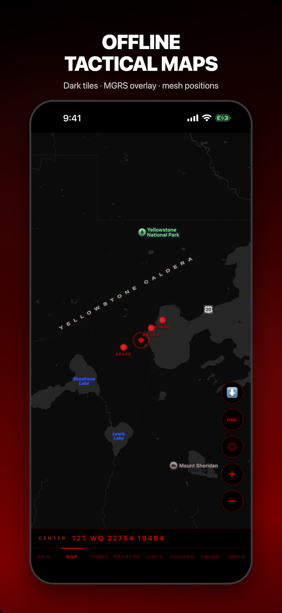
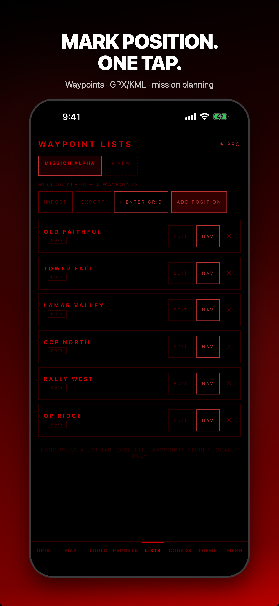
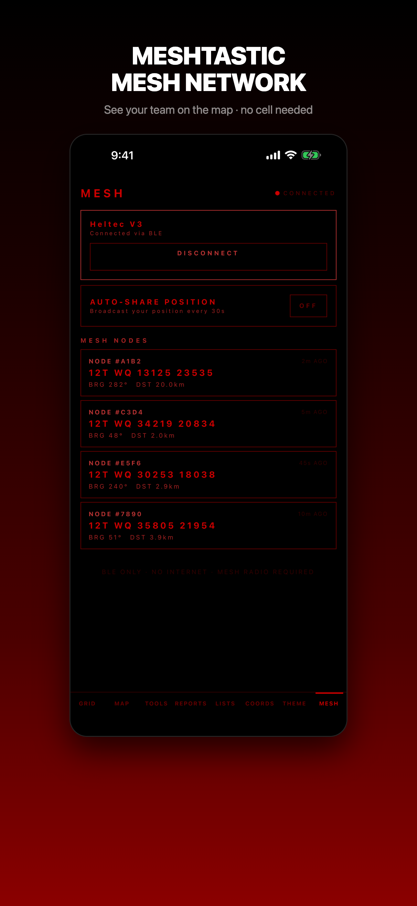

# Red Grid MGRS

**DAGR-Class MGRS Navigator**

[](https://apps.apple.com/app/id6759629554)
[](https://play.google.com/store/apps/details?id=com.redgrid.redgridtactical)
[](LICENSE)
[](PRIVACY.md)
[](https://github.com/RedGridTactical/RedGridMGRS/stargazers)

> ⭐ If you find this useful, consider [starring the repo](https://github.com/RedGridTactical/RedGridMGRS) — it helps others discover it.

The military's DAGR (AN/PSN-13) costs $2,500 and weighs a pound. Red Grid MGRS puts the same core land navigation capabilities in your pocket — live 10-digit MGRS, magnetic declination, waypoints, bearing and distance — for free. No network required. No data collected. Open source.

---

## Latest: v3.3.2 — Now on Android

- **📱 Google Play launch** — [Red Grid MGRS is now live on Google Play](https://play.google.com/store/apps/details?id=com.redgrid.redgridtactical). Same zero-network architecture, same DAGR-class MGRS, same open source code — now on both platforms.
- **Map zoom controls** — dedicated + / – buttons and a one-tap Recenter-on-Me control. No more pinch-gymnastics with the phone against your chest.
- **Screenshot compositor** — Puppeteer pipeline that renders App Store + Play Store frames directly from simulator captures. Clean marketing output in one command.
- **Degree-symbol + altitude fixes** on the Mesh screen node cards.
- All v3.3.1 features — **MARK POSITION**, **offline map prompt**, **share-to-unlock referral**, **in-app What's New**.

---

| Grid & Wayfinder | Offline Maps + Mesh | Tools | Reports |
|:---:|:---:|:---:|:---:|
|  |  |  |  |
| **Waypoint Lists** | **Mesh Network** | | |
|  |  | | |

---

## DAGR-Equivalent Features

- **Live MGRS coordinates** — 4/6/8/10-digit precision, 1-meter resolution
- **Magnetic declination** — WMM model, auto or manual offset
- **Waypoint storage** — bearing and distance to any saved position
- **Back azimuth and dead reckoning** — plot movement from a known point
- **Speed, elevation, heading** — real-time sensor display
- **Full offline operation** — zero cloud dependency

## Beyond the DAGR — 10 Tactical Tools

The DAGR hardware doesn't include these. Red Grid MGRS does.

- Back Azimuth calculator
- Dead Reckoning plotter
- Two-point Resection
- Pace Count tracker
- Magnetic Declination reference
- Time-Distance-Speed solver
- Sun & Moon position data
- MGRS Precision selector (1m to 100km)
- Elevation & Slope calculator
- Photo Geostamp — burn MGRS + DTG onto any photo (Pro)

## Offline Tactical Maps

Download OpenStreetMap tiles for your area of operations. Dark tactical tiles for low-vis environments. Toggle offline mode to use cached tiles with zero network. Works completely disconnected from any infrastructure. Pro feature.

## Meshtastic Mesh Networking

Share your grid position over LoRa mesh via BLE. See other mesh users in real time. No cell service, no internet, no infrastructure needed — just Meshtastic radios and phones. Pro feature.

### Meshtastic Setup

1. Flash [Meshtastic firmware](https://flasher.meshtastic.org) onto a compatible radio (Heltec V3/V4, T-Beam Supreme, RAK WisBlock, etc.)
2. **Close the Meshtastic app** before scanning from Red Grid MGRS — iOS only allows one app to hold a BLE connection to a device at a time. If the Meshtastic app is connected, Red Grid cannot discover the radio.
3. Open Red Grid MGRS → Mesh tab → Scan → tap your radio to connect
4. Toggle Auto Share to broadcast your position over the mesh

Supported radios: any Meshtastic device with ESP32-S3 + SX1262 LoRa at 915MHz (US). Recommended: [Heltec WiFi LoRa 32 V3/V4](https://heltec.org/project/wifi-lora-32-v3/) or [LILYGO T-Beam Supreme](https://lilygo.cc/products/t-beam-supreme).

## 6 Radio-Ready Report Templates

Generate formatted reports ready to transmit over any net:

- SALUTE (Size, Activity, Location, Unit, Time, Equipment)
- 9-Line MEDEVAC request
- SPOT report
- ICS 201 incident briefing
- CASEVAC request
- ANGUS/CFF fire mission

## Pricing

### Free
Live 10-digit MGRS display, 1 theme, 3 tools (Back Azimuth, Pace Count, Declination), 3 report templates (SALUTE, 9-Line MEDEVAC, SPOT), 1 waypoint.

### Pro — 3 tiers
| Tier | Price |
|------|-------|
| Monthly | $3.99/mo |
| Annual | $29.99/yr (best value) |
| Lifetime | $149.99 one-time |

All Pro tiers unlock:
- **10-digit MGRS** — full 1-meter precision for all users
- **All 10 Tactical Tools** — free includes Back Azimuth, Pace Count, Declination
- **All 6 Report Templates** — free includes SALUTE, MEDEVAC, SPOT
- **Offline Tactical Maps** — download OpenStreetMap tiles, dark tactical tiles, zero-network map use
- **Meshtastic Mesh Networking** — share position over LoRa mesh via BLE, see other nodes
- **External GPS** — Garmin GLO, Bad Elf via BLE for enhanced accuracy
- **Mission Planning** — route overlay, leg distances, nearest-neighbor optimization
- **GPX/KML Import & Export** — document picker import, Share sheet export
- **NATO Voice Readout** — hands-free grid calls using phonetic alphabet
- **Shake to Speak** — shake device for hands-free NATO grid readout
- **HUD Mode** — full-screen tactical display with compass and wayfinder
- **Photo Geostamp** — burn MGRS grid + DTG onto any photo, saved to camera roll
- **Grid Crossing Alerts** — haptic feedback at 1km and 100m boundaries
- **Coordinate Formats** — UTM, decimal degrees, DMS on the main grid display
- **FixPhrase** — open-source What3Words alternative
- **4 Display Themes** — red lens, NVG green, day white, blue force
- **Unlimited Waypoints** — saved lists, patrol routes, OBJs, rally points
- **Adjustable Grid Scale** — 0.7x–1.5x MGRS font size
- **6 Languages** — EN, FR, DE, ES, JA, KO

---

## Install

### iOS
[App Store](https://apps.apple.com/app/id6759629554) — Free with optional Pro upgrade ($3.99/mo, $29.99/yr, or $149.99 lifetime).

### Android
[Google Play](https://play.google.com/store/apps/details?id=com.redgrid.redgridtactical) — Free with optional Pro upgrade ($3.99/mo, $29.99/yr, or $149.99 lifetime). Android 7+ (API 24+). First production release April 2026.

### Build from Source

```bash
git clone https://github.com/RedGridTactical/RedGridMGRS.git
cd RedGridMGRS
npm install
npx expo start
```

Standard features work from source. Pro features require a valid purchase through Apple or Google.

---

## Privacy

| Data | Collected | Stored | Transmitted |
|------|-----------|--------|-------------|
| GPS location | In memory only | Never | Never |
| Waypoints (Standard) | In memory, cleared on exit | Never | Never |
| Waypoint lists (Pro) | On device only | Local only | Never |
| Settings (pace/declination/theme) | On device only | Local only | Never |
| Device identifiers | Never | Never | Never |

No ad networks. No analytics. No crash reporting. No third-party SDKs.
In-app purchases are processed by Apple — Red Grid MGRS never sees your payment details.

Full policy: [Privacy Policy](https://redgridtactical.github.io/RedGridMGRS/privacy.html) | [PRIVACY.md](PRIVACY.md)

---

## Need Team Tracking?

**[Red Grid Link](https://github.com/RedGridTactical/RedGridLink)** adds encrypted peer-to-peer team sync to the same MGRS engine. Your whole team shows up on the map over Bluetooth. No servers, no cell service. Team roles, boundary alerts, waypoint sharing, NATO voice callouts. Free on [iOS](https://apps.apple.com/app/red-grid-link/id6760084718).

> Red Grid MGRS = solo navigator. Red Grid Link = team coordinator. Same engine, same precision.

---

## Built For

Military personnel, search and rescue teams, law enforcement, wildland firefighters, first responders, hunters, and backcountry navigators who depend on accurate grid coordinates in austere environments. Whether you trained on a DAGR or a lensatic compass, Red Grid MGRS speaks your language.

---

## Roadmap

> **iOS + Android both live.** Cross-platform (React Native/Expo). Full roadmap at [redgridtactical.com/roadmap](https://redgridtactical.com/roadmap.html).

### v1.0 — Foundation ✅ (2026)
- Real-time MGRS coordinates (1m precision), wayfinder arrow, 8 tactical tools, 3 report templates, red-on-black display, zero-network architecture

### v2.0 — Pro Launch ✅ (2026)
- Pro IAP, 4 themes, 6 reports, unlimited waypoints, coordinate formats, magnetic declination, haptics, accessibility

### v2.1 — Polish ✅ (2026)
- Custom grid input, compass heading, waypoint coordinate editing, copy-to-clipboard

### v2.2 — Pro Features ✅ (2026)
- HUD mode, photo geostamp, shake-to-speak, grid crossing alerts, in-app support

### v2.3 — Global Expansion ✅ (2026)
- 3-tier subscriptions, 6-language i18n, 26-locale ASC listings, Android closed testing, startup crash fix

### v2.5 — Interoperability ✅ (2026)
- FixPhrase integration (open-source, patent-free What3Words alternative)
- GPX/KML waypoint export via Share sheet
- Elevation and slope calculator tool (10th tactical tool)
- OLED true black themes (pure #000000)
- [MGRS Tactical Toolkit](https://redgridtactical.github.io/RedGridMGRS/tools.html) — web-based converter, single HTML file, zero dependencies

### v2.6 — Open Source Library ✅ (2026)
- `@redgrid/mgrs` npm package — DMA TM 8358.1 compliant MGRS library
- Standalone conversion, bearing, distance, dead reckoning, FixPhrase
- Zero dependencies, ~15 KB

### v3.0 — Tactical Map ✅ (2026)
- Offline OpenStreetMap tiles (no API key, fully local)
- MGRS grid overlay on map
- Mission planning (waypoints on map, route plotting, nearest-neighbor optimization)
- GPX/KML import
- External GPS support (Garmin GLO, Bad Elf via BLE)
- Meshtastic/LoRa off-grid position sharing

### v3.2 — Polish & Scale ✅ (2026)
- Adjustable grid display scale

### v3.2.1 — Offline Tile Download ✅ (2026)
- Download map tiles for offline use from the map screen
- Toggle offline mode to use cached tiles with zero network
- Dark tile support matching current tactical theme
- Cache indicator and tile count in bottom bar
- Fixed subscription metadata for monthly and annual plans

### v3.2.2 — Free 10-Digit MGRS, Topo Maps ✅ (2026)
- Free tier now includes full 10-digit MGRS (1-meter precision for all users)
- Topographic map layer with contour lines and terrain features (OpenTopoMap)
- Map style toggle: Standard, Dark Tactical, Topographic
- Themed waypoint creation menu (light discipline — no white popups)
- Navigate-to-waypoint from map

### v3.2.3 — iOS BLE Fix ✅ (2026)
- Fixed iOS BLE permissions — Meshtastic mesh networking now works on iPhone
- "Add Position" button renamed and always visible in waypoint lists

### v3.2.4 — Meshtastic BLE Protocol Rewrite ✅ (2026)
- Complete rewrite using real Meshtastic protobuf protocol
- Correct ToRadio UUID, startConfig handshake, FromNum notifications
- Shared BleManager, waitForPoweredOn state check
- Compatible with actual Meshtastic hardware

### v3.3.0 — Field Ready ✅ (2026)
- Mesh positions rendered on map with node ID, MGRS, bearing, distance
- Meshtastic setup guide with BLE exclusivity note

### v3.3.1 — Faster in the Field ✅ (2026)
- One-tap MARK POSITION from the main screen
- First-visit offline map download prompt
- Share-to-unlock 30-day Pro trial referral (HMAC-signed deep links)
- In-app What's New modal for returning users

### v3.3.2 — Now on Android ✅ (2026)
- **First Android production release on Google Play** (worldwide, 177 regions)
- Map zoom +/– controls and Recenter-on-Me button
- Screenshot compositor pipeline (Puppeteer, Phone + 7" + 10" tablet frames)
- Mesh node card polish (degree symbol, altitude guard)
- Local build pipeline (off EAS, Xcode 26 + fastlane + Gradle)

### v3.3.3 — Smoother in the Field ✅ (2026)
- In-app review prompt fires at natural moments (right after a successful MARK POSITION) instead of random launches
- Pro users bypass the launch-time gate — asked sooner, since they've already converted
- Write-review URL opens directly so users land on the text-review sheet (not the star-only rating sheet)
- Background tuning and stability polish across the grid, map, and tools

### v3.3.4 — Tap-to-Delete Waypoints 🟡 (2026, iOS in Apple review)
- Tap any waypoint pin on the map to see its details and remove it
- Closes a long-standing gap where free users couldn't clear plotted markers (the LISTS tab is Pro-gated)
- NAV / DELETE / Close action card appears in-place so you don't leave the map
- Works on both free and Pro plans
- Android v3.3.4 held until the SDK 53 / RN 0.77 upgrade lands (which unlocks the 16 KB page-size alignment Google Play requires for updates)

### v3.5 — Solo Operator (2026)
- Camera-based target acquisition (point camera at distant point, get its MGRS grid)
- Encrypted Meshtastic channels from app
- Background position broadcast
- CoT export (broadcast own position for ATAK interop)
- Apple Watch companion (grid + bearing on wrist, NVG-readable)
- Route planning with elevation profile
- Satellite connectivity optimization for T-Mobile Starlink on Android

### v4.0 — Ecosystem Integration (2026-2027)
- Offline voice commands ("Mark position" / "Send grid" / "Navigate to waypoint")
- Inertial navigation fallback (IMU dead reckoning in GPS-denied environments)
- Satellite position reporting (iOS Satellite API when available, Android NTN)
- Custom report templates (define your own formats for any SOP)
- Sensor fusion (barometric + IMU + GPS + external GPS)

### v5.0 — Platform (2027+)
- iOS Live Activity + Dynamic Island, Widgets, Siri Shortcuts
- Integration API for third-party apps
- Sensor fusion (barometric, IMU, external GPS, mesh multilateration)

> **Team features** (roles, messaging, geofencing, shared waypoints, AAR) are in [Red Grid Link](https://github.com/RedGridTactical/RedGridLink). MGRS is the solo navigator. Link is the team coordinator.

---

## Support

- [Report an issue](https://github.com/RedGridTactical/RedGridMGRS/issues)
- [Support page](https://redgridtactical.github.io/RedGridMGRS/support.html)
- Email: support@redgridtactical.com

---

## Red Grid Tactical Ecosystem

| App | Purpose | Platform | Link |
|-----|---------|----------|------|
| **Red Grid MGRS** | Solo MGRS navigator (DAGR-class) | iOS | [GitHub](https://github.com/RedGridTactical/RedGridMGRS) · [App Store](https://apps.apple.com/app/id6759629554) |
| **Red Grid Link** | Team coordination + encrypted sync | iOS | [GitHub](https://github.com/RedGridTactical/RedGridLink) · [App Store](https://apps.apple.com/app/red-grid-link/id6760084718) |

Website: [redgridtactical.com](https://redgridtactical.com)

---

## License

[MIT + Commons Clause](LICENSE) — free for personal non-commercial use. Commercial use requires written permission.

---

*Your phone. DAGR capability. No frills. No tracking. Open source.*
