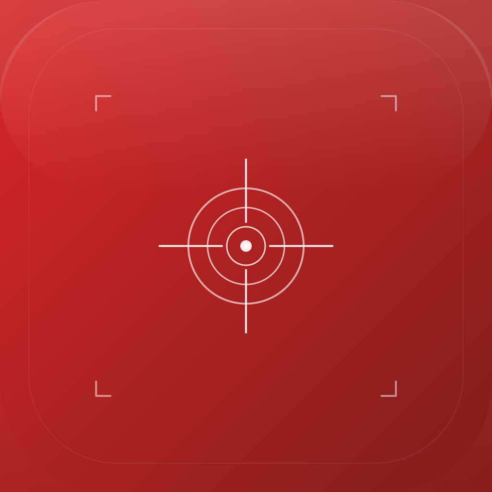

# Red Grid MGRS

**MGRS coordinates and field navigation for iOS and Android.**

[App Store](https://apps.apple.com/app/id6759629554) · [Google Play](https://play.google.com/store/apps/details?id=com.redgrid.redgridtactical) · [Website](https://redgridtactical.com/mgrs) · [MGRS converter](https://redgridtactical.com/tools)

Read your grid, prepare a route, and navigate between saved points. Core coordinate tools work without an internet connection when your device has a usable location fix. The app has no Red Grid accounts, advertising, analytics or cloud sync.

This branch contains **4.0.5**. Store availability follows Apple and Google review; source availability does not mean a release is already available in both stores.

## Field workflow

- **Read your position:** live 10-digit MGRS, compass, bearing and distance. A one-meter grid square describes coordinate resolution, not guaranteed GPS accuracy.
- **Prepare a route:** save waypoint lists and check location, map coverage and optional radio readiness.
- **Navigate and review:** follow the selected route, manually confirm points and resume local progress after reopening the app. The last 10 session summaries record planned points and confirmations, not a continuous movement track.
- **Choose a display:** a standard display for everyday readability, or red-on-black Tactical display with brightness controls and blackout recovery. Phone screens and operating-system surfaces vary; this is not night-vision equipment certification.
- **Prepare offline maps:** import a compatible local MBTiles file before leaving connectivity, then verify coverage. Maps are not bundled with the app. Public-provider bulk tile downloads are disabled.
- **Connect a radio if needed:** optional Meshtastic support uses compatible radio hardware over Bluetooth. Phones alone do not provide this radio link.

## Free and Pro

Free includes live 10-digit MGRS, a single saved waypoint, four tools (Back Azimuth, Pace Count, Declination and Distress Signalling), and three report templates (SALUTE, 9-Line MEDEVAC and SPOT).

Pro adds all 12 tools and six report templates, up to 10 waypoint lists with 20 points each, saved route workflows, supported MBTiles imports, GPX/KML import and export, optional radio features, additional coordinate formats, voice readout, HUD and display controls.

Pro is available as a monthly subscription or a one-time lifetime purchase. Check the app for current prices in your region. Apple or Google processes purchases and manages subscription settings.

The MBTiles importer supports raster maps with 256 × 256 PNG tiles, up to 5,000 tiles, a 256 MB archive and 128 MB of extracted tile data. Vector, JPEG and WebP tile archives are not supported. Supply a map you have permission to use and retain its attribution.

## Privacy

Saved waypoints, routes, session summaries, settings and imported maps live in local app storage. Exporting files or enabling radio sharing sends the information you choose to share outside the app. Other devices, receiving radios and operating-system backups may retain their own copies.

Online maps use platform map services and tile providers. Purchases use Apple or Google. These providers handle their own service requests; offline-first does not mean every optional feature makes zero network requests. The app does not embed advertising, analytics or crash-reporting SDKs.

See [PRIVACY.md](PRIVACY.md) and the [website privacy policy](https://redgridtactical.com/privacy).

## Why the source is available

Inspectable source lets people examine how coordinates, local storage and optional sharing work. A store installation provides a maintained, ready-to-install app without setting up a native build environment. Pro purchases support continued development and unlock the additional workflows described above.

The source is available under [LICENSE](LICENSE), which includes the Commons Clause and an additional commercial-use restriction. It is not an unrestricted open-source license. The license has not changed with this release.

## Build locally

The project uses JavaScript, React Native 0.79.6 and Expo SDK 53. Native modules require a native build; Expo Go is not supported. Minimum supported versions are iOS 15.1 and Android 7 (API 24).

```bash
git clone https://github.com/RedGridTactical/RedGridMGRS.git
cd RedGridMGRS
npm ci
npx expo run:ios
# Or: npx expo run:android
```

Build iOS releases locally with Xcode and Android releases locally with Gradle or Android Studio. `npm ci` applies the committed native map patch through `patch-package`. Store purchases require the appropriate store signing, product configuration and purchase environment.

Run the test suite with:

```bash
npx jest --no-cache --verbose
```

## Radio setup

1. Configure compatible Meshtastic hardware for your region and intended channel.
2. Disconnect another app from the radio if it is holding the Bluetooth connection.
3. Open the Mesh tab, scan and connect to the radio.
4. Enable position sharing only when you intend to transmit it. Configure a shared Team Key when using encrypted team payloads.

Team encryption does not hide radio identifiers, packet timing or all radio traffic. Radio settings and position-sharing choices affect what is transmitted. Test the complete setup before relying on it in the field.

## Project and support

Red Grid Link has merged into Red Grid MGRS. Link's former phone-to-phone transport is not part of MGRS; MGRS radio features require Meshtastic hardware. [Link's archived source](https://github.com/RedGridTactical/RedGridLink) remains available.

The coordinate library lives in [packages/mgrs](packages/mgrs). See the [roadmap](https://redgridtactical.com/roadmap), [report an issue](https://github.com/RedGridTactical/RedGridMGRS/issues), or contact support@redgridtactical.com.
