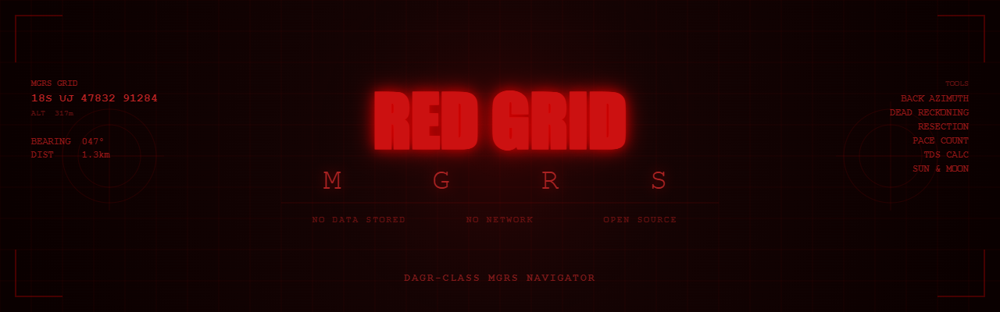
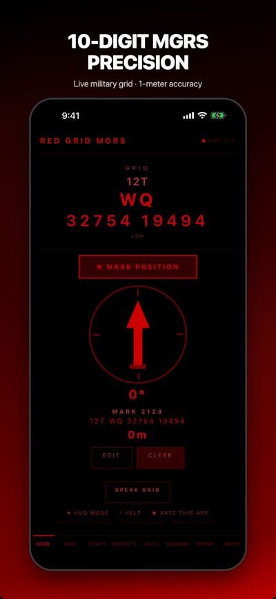
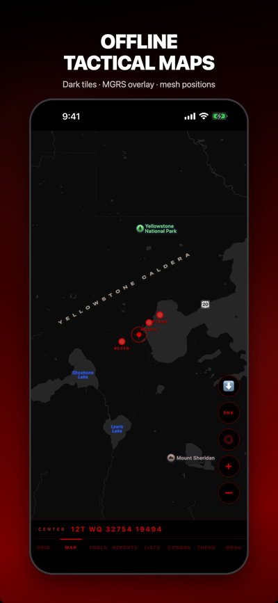
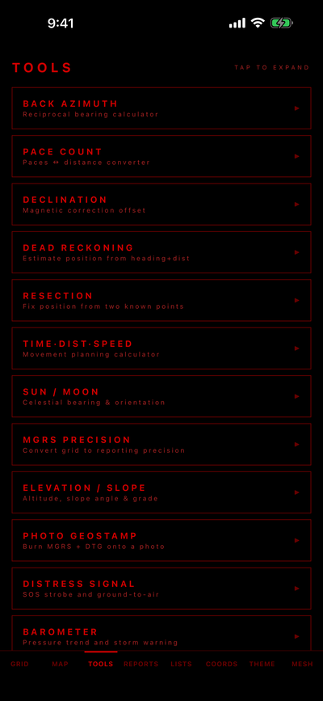
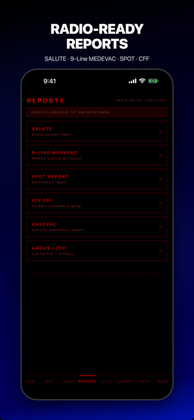
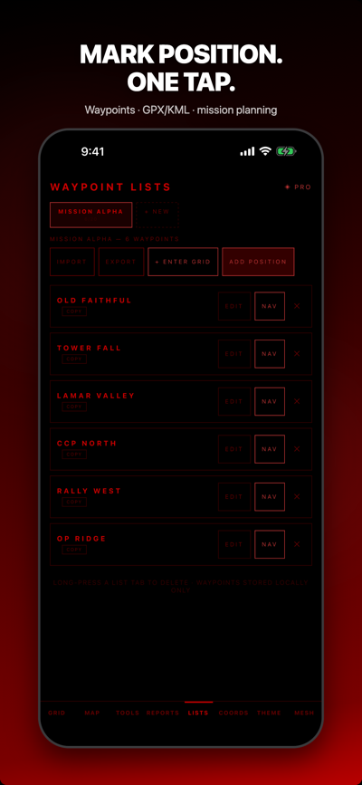
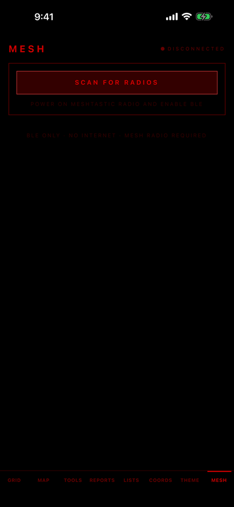

# Red Grid MGRS

**DAGR-Class MGRS Navigator** — a $2,500 military GPS in your pocket.

[](https://apps.apple.com/app/id6759629554)
[](https://play.google.com/store/apps/details?id=com.redgrid.redgridtactical)
[](LICENSE)
[](PRIVACY.md)
[](https://github.com/RedGridTactical/RedGridMGRS/stargazers)

The military's DAGR (AN/PSN-13) costs $2,500 and weighs a pound. Red Grid MGRS puts the same core land-navigation capability in your pocket: live 10-digit MGRS, magnetic declination, waypoints, bearing and distance, offline tactical maps, and Meshtastic mesh — all of it offline-first. No network required, no accounts, no analytics, no tracking. Location stays in memory only. Built in collaboration with active-duty and retired U.S. Army soldiers; source-available so you can read every line.

[**Download on the App Store**](https://apps.apple.com/app/id6759629554) · [**Get it on Google Play**](https://play.google.com/store/apps/details?id=com.redgrid.redgridtactical) · [**Try the free web MGRS converter**](https://redgridtactical.github.io/RedGridMGRS/tools.html)

---

## Features

- **Live MGRS coordinates** — 4/6/8/10-digit precision, 1-meter resolution, free for everyone
- **Magnetic declination** — WMM model, auto or manual offset
- **Waypoints & wayfinder** — bearing and distance to any saved position
- **12 tactical tools** — Back Azimuth, Dead Reckoning, Resection, Pace Count, Declination, Time-Distance-Speed, Sun & Moon, Precision selector, Elevation & Slope, Photo Geostamp, Barometer & Storm Warning, Distress Signalling
- **True grid direction** — grid convergence and the G-M angle computed at your position, so magnetic, true, and grid north agree with the map in your hand (FM 3-25.26). Distances and bearings are solved on the WGS84 ellipsoid, not a sphere
- **Offline tactical maps** — download OpenStreetMap / topographic tiles for your AO, dark tiles for low-vis, zero-network use
- **Mission Preflight** — one-glance READY / CAUTION / NOT READY check across GPS, mesh, tile coverage, permissions, and battery
- **Meshtastic mesh** — share your grid over LoRa via BLE and see other nodes; no cell, no internet
- **External GPS** — Garmin GLO, Bad Elf and other BLE receivers feed every screen
- **6 radio-ready reports** — SALUTE, 9-Line MEDEVAC, SPOT, ICS 201, CASEVAC, ANGUS/CFF fire mission
- **Interop & export** — GPX/KML import & export, mission planning with route optimization
- **NATO voice, HUD mode, grid-crossing alerts, coordinate formats, FixPhrase**
- **16 languages** — EN, FR, DE, ES, JA, KO, IT, NL, PT-BR, RU, ZH-Hans, ZH-Hant, TR, PL, AR, HI

| Grid & Wayfinder | Offline Maps + Mesh | Tools | Reports |
|:---:|:---:|:---:|:---:|
|  |  |  |  |
| **Waypoint Lists** | **Mesh Network** | | |
|  |  | | |

---

## Pricing

The app is free to download. Full 10-digit MGRS (1-meter precision) is never gated.

**Free:** live 10-digit MGRS, map screen, 1 saved AO package, 1 theme, 4 tools (Back Azimuth, Pace Count, Declination, Distress Signalling), 3 report templates (SALUTE, 9-Line MEDEVAC, SPOT), 1 waypoint.

| Tier | Price |
|------|-------|
| Monthly | $3.99/mo |
| Annual | $29.99/yr — **best value, save 37% vs monthly** |
| Lifetime | $199.99 one-time |

Pro unlocks all 12 tools, all 6 reports, offline tactical maps, Meshtastic mesh, external GPS, mission planning, GPX/KML import & export, NATO voice readout, shake-to-speak, HUD mode, photo geostamp, grid-crossing alerts, coordinate formats, FixPhrase, all 4 themes, unlimited waypoints, and adjustable grid scale. In-app purchases are processed by Apple or Google — Red Grid MGRS never sees your payment details.

---

## Privacy

Zero-network by design. No accounts, no ad networks, no analytics, no crash reporting, no third-party SDKs.

| Data | Collected | Stored | Transmitted |
|------|-----------|--------|-------------|
| GPS location | In memory only | Never | Never |
| Waypoints (Free) | In memory, cleared on exit | Never | Never |
| Waypoint lists (Pro) | On device only | Local only | Never |
| Settings (pace / declination / theme) | On device only | Local only | Never |
| Device identifiers | Never | Never | Never |

Full policy: [Privacy Policy](https://redgridtactical.github.io/RedGridMGRS/privacy.html) · [PRIVACY.md](PRIVACY.md)

---

## Install & Develop

**iOS** — [App Store](https://apps.apple.com/app/id6759629554), iOS 12+. Free, with optional Pro upgrade.

**Android** — [Google Play](https://play.google.com/store/apps/details?id=com.redgrid.redgridtactical), Android 7+ (API 24+). Free, with optional Pro upgrade.

**Build from source** — React Native 0.79.6 / Expo SDK 53. The app uses native modules (Bluetooth LE, in-app purchases, maps), so it needs a development build and cannot run in Expo Go.

```bash
git clone https://github.com/RedGridTactical/RedGridMGRS.git
cd RedGridMGRS
npm install
npx expo run:ios      # or: npx expo run:android
```

Run the tests with `npm test`. Standard features work from source; Pro features require a valid purchase through Apple or Google.

---

## Meshtastic Setup

1. Flash [Meshtastic firmware](https://flasher.meshtastic.org) onto a compatible radio (Heltec V3/V4, T-Beam Supreme, RAK WisBlock, etc.).
2. **Close the Meshtastic app** before scanning — iOS allows only one app to hold a BLE connection to a device at a time, so Red Grid can't discover the radio while the Meshtastic app is connected.
3. Open Red Grid MGRS → Mesh tab → Scan → tap your radio to connect.
4. Toggle Auto Share to broadcast your position over the mesh.

Supported radios: any Meshtastic device with ESP32-S3 + SX1262 LoRa at 915 MHz (US). Recommended: [Heltec WiFi LoRa 32 V3/V4](https://heltec.org/project/wifi-lora-32-v3/) or [LILYGO T-Beam Supreme](https://lilygo.cc/products/t-beam-supreme).

---

## Built For

Military personnel, search-and-rescue teams, law enforcement, wildland firefighters, first responders, hunters, and backcountry navigators who depend on accurate grid coordinates in austere environments. Whether you trained on a DAGR or a lensatic compass, Red Grid MGRS speaks your language.

---

## Ecosystem

| App | Purpose | Platform | Link |
|-----|---------|----------|------|
| **Red Grid MGRS** | Solo MGRS navigator (DAGR-class) | iOS + Android | [App Store](https://apps.apple.com/app/id6759629554) · [Google Play](https://play.google.com/store/apps/details?id=com.redgrid.redgridtactical) |
| **Red Grid Link** | Team coordination + encrypted P2P sync | iOS + Android | [GitHub](https://github.com/RedGridTactical/RedGridLink) · [App Store](https://apps.apple.com/app/red-grid-link/id6760084718) |

**Red Grid Link is merging into Red Grid MGRS.** Team awareness is becoming an encrypted layer on the same offline map in v4.0, so there is one app and no second purchase. Link stays installed and working on devices that have it, but it is feature-frozen and all new work happens here.

The `@redgrid/mgrs` library (DMA TM 8358.1 compliant, zero dependencies, ~15 KB) lives in [`packages/mgrs`](packages/mgrs). Full roadmap at [redgridtactical.com/roadmap](https://redgridtactical.com/roadmap.html).

---

## Roadmap

Full detail at [redgridtactical.com/roadmap](https://redgridtactical.com/roadmap.html).

### v4.0 — The Survival Update (next)

The release that makes the app tell you the truth about where you are, and keeps working when things go wrong.

- **Grid convergence and the G-M angle** — your compass, true north, and the grid north printed on your map are three different directions. Red Grid computes the difference at your position and converts between them, per FM 3-25.26. Declination on its own is not the number a grid map needs, and convergence reaches 2.7° near a UTM zone edge at 65°N: 475 m of lateral error over a 10 km leg.
- **Ellipsoidal distance and bearing** — solved on WGS84 with Vincenty's inverse instead of a spherical approximation, which was off by 0.22–0.36% (about 200 m over 92 km).
- **Point scale factor** — what a distance measured off the grid actually costs you on the ground.
- **Barometric storm warning** — on-device pressure trend with altitude correction, so a climb is not mistaken for a front. No forecast service, no network.
- **Distress signalling** — SOS, arbitrary Morse, and the standard ground-to-air pattern on screen and torch, with battery-aware duty cycles. Free for everyone; an emergency signal is not a paid feature.
- **Encrypted team awareness over Meshtastic** — your team on the same offline map plus short tactical messages, sealed end to end with AES-256-GCM. Pairing by QR code, keys generated on device and never transmitted. No server, no accounts, no tracking.

### After that

| Version | Theme |
|---------|-------|
| v4.1 | Interoperability Pack — Cursor-on-Target export, KML/KMZ mission packages, "Copy as" |
| v4.2 | SAR / ICS Field Pack — mobile-scoped FEMA/NIMS forms, incident folders, segment helper |
| v4.3 | Land Nav Training Mode — course mode, pace and azimuth drills, instructor export |
| v5.0 | Glanceable Field Companion — Apple Watch, widgets, Live Activity, Siri shortcuts |
| v5.x | R&D — GPS spoof/jam integrity, camera target acquisition, GPS-denied dead reckoning |

---

## Support

- [Report an issue](https://github.com/RedGridTactical/RedGridMGRS/issues)
- [Support page](https://redgridtactical.github.io/RedGridMGRS/support.html)
- Email: support@redgridtactical.com

---

## License

[MIT + Commons Clause](LICENSE) — source-available, free for personal non-commercial use. Commercial use requires written permission.

*Your phone. DAGR capability. No frills. No tracking. Source available.*
